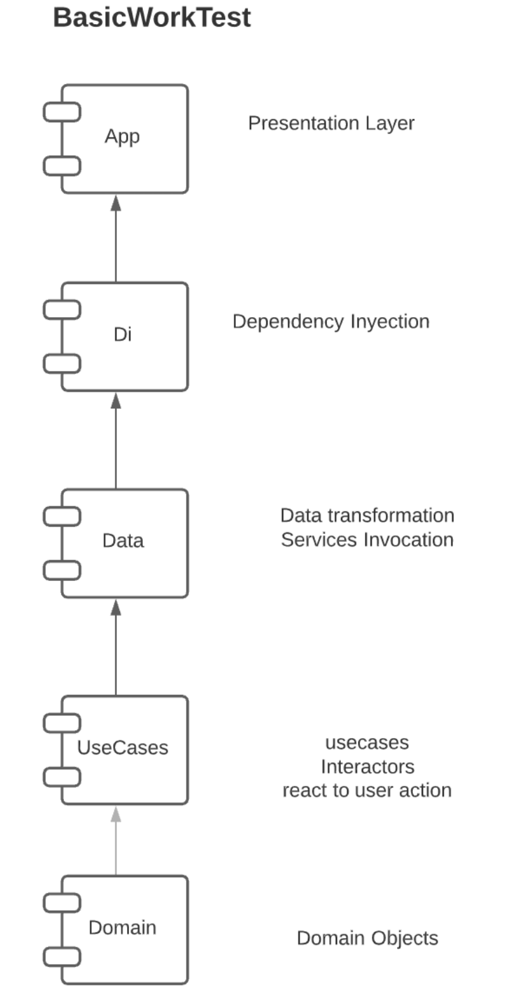

# BREAKING BAD-Android

## walkthrough App

## Technical details

### Android Studio Artic Fox 2020.3.1 patch 3

Android Project Mvvm Clean Architecture 5 Layers.

  

Relevant Tech implemented:

- Moshi
- Koin
- Coroutines
- LiveData
- Mockito
- Glide
- Room
- Retrofit

Complexity in order to demonstrate knowledge over architecture, decoupling and scalability capabilities

Aplication features:

- No internet notificationLiveData
- Database Room read, create and delete favourites by ID Character
- Pagination 
- Unit Test demonstration by layer

Relevant pattern:

- Repository 
- Singleton 
- Abstract Factory
- Adapter
- Observer
- Builder

App Description

Main view scrolllist of characters filtered by favourite at the begining, scrolling loader characters at demand, pagination, favourite and no favourite interaction button. 
Second view description of character selected on the list, added a episode description in order to show more information.

## Author
Denise Méndez